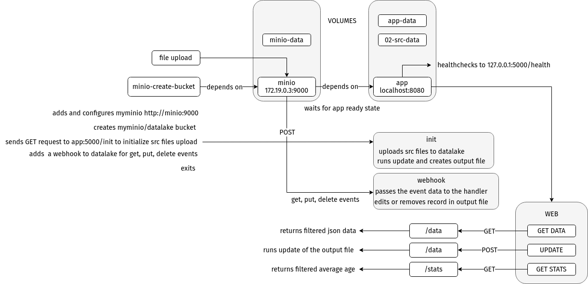

# User Data App
A Python application that allows you to aggregate csv files into a single csv database. Edit the files and get the database updated instantly. Update the database manually and receive the records in json format via the web interface.
All files are stored in MinIO, an object storage server compatible with Amazon S3 API. Everything runs inside docker containers, so no need to install anything besides Docker itself.

## Prerequisites:

Docker 19.03 or greater

Docker-compose 1.26 or greater


## Usage:

go to project root directory, where Makefile is located and run:
```
make
```
That will run the docker compose script and deploy three containers.

*Wait for about a minute* for all containers to spin up.

To stop press `Ctrl+C`.

### Other commands:

`make run` deploys the containers.

`make rm` removes the containers.

`make rmi` removes the images.

`make clean` removes containers and images.

<hr>

## MinIO

Open a browser and go to:

`172.19.0.3:9000` and login into the MinIO service web interface using these credentials:

Username: `admin`

Password: `password`

You should see two buckets: `datalake` and `processed-data`.

Drag and drop a .csv or .png file to upload to the datalake bucket.

### Note:
*A .csv file should contain one row of data and the following field names:*

*`first_name, last_name, birthts`*

*The file names representing a distinct user should be equal as they serve as a user ID.*

Upload files one by one and go to the processed-data bucket.
Download the output.csv file with the updated info.
### Note:
*`Refresh` button should be clicked every time you update the file to get the link to its latest version.*

<hr>

## The App
In another tab open:
`http://localhost:8080` to see the web app front end.

There are two forms and an `UPDATE DATA` button.

Fill in the search criteria in the first form and hit `GET DATA` to get the data in JSON format.

Press `GET STATS` in the second form to see the average age of the selected group.

Use `UPDATE DATA` button when the output.csv file needs to be updated. Though in most cases you'll see the changes reflected automatically.

<hr>

## Details



The process starts with the Python app image building up, downloading dependencies and running the container with the Flask web server on `http://localhost:8080` and the `minio` and `minio/mc` containers.

The app container starts sending requests to its `http://127.0.0.1:5000/health` endpoint to set its status as healthy.

The minio container makes the API avalaible on `172.19.0.3:9000` and waits for the app container to get ready to receive requests.

After some delay the minio container starts sending request to `http://app:5000/webhook` endpoint of the app. When the endpoint becomes reachable, minio defines a `webhook`.

At this point minio/mc container runs the mc tool with the commands to setup and configure a `myminio` host at `http://minio:9000`, using credentials stored in its environment variables.

It goes on to create a datalake bucket and set a `download` policy on it, then it sends a request to `http://app:5000/init`, which triggers the `init()` function of the app.

The init() function uploads the files from the source directory if the datalake bucket is empty.

Then triggers the aggregation of files in the datalake to create the `output.csv` file in the `processed-data` bucket.

`minio/mc` waits for 5 seconds to let the upload process to complete, then sets the `webhook` for the `get`, `put` and `delete` events on the datalake and stops running.

### Note:
*The webhook is set only after a delay to let the initial file upload to complete without triggering the event handler at this point.*

From now on the app is ready to receive and respond to events relayed to it by webhook requests.

When the user uploads a file to the datalake the `put` event is emitted which triggers the `modify()` function which downloads that source file and the output file, reads them to see if an existing record needs to be modified or a new record to be added.
The updated output file is uploaded back to the processed-data bucket, overwriting its previous version.

When a file is deleted from the datalake, the file extension is checked. Deleting a .csv file will remove the user info from the record. Deleted .png file removes the image path from the record. If the file being removed is the last one with that id, the record is removed from the output file completely.

## The Front-end

The forms on the index page allow to fetch data from the database.

The `GET DATA` button makes a GET request to the `/data` endpoint, sending parameters entered by the user in the corresponding form and getting a response in JSON format.

The parameters and their default values are:

`is_image_exists` == "off".

`min_age` == 1.

`max_age` == 150.

If a parameter is not provided its default value is taken into account as a filter criterion.

None of the inputs is required, so the empty form request will get the whole database in response.

The same goes for `GET STATS` button, which sends a GET request to the `/stats` endpoint, where the same filtering process is executed, with the only difference in response object, which in this case is the calculated average of the ages of users. The result gets printed in the html response.

The `UPDATE DATA` button sends a POST request to the `/data` endpoint and triggers the `update` event handler which basically downloads all the files from the datalake only, aggregates them into one object, writes this object to output.csv file on disk and uploads it to the processed-data bucket, overwriting the existing output file.

<hr>

### Known bugs:

The app can't handle batch file upload and deletion.
It either handles only the first file in the sequence or destroys the db completely.
That's where you really need the `UPDATE DATA` button, as it reads the sources in the datalake and rebuilds the db.
I'm yet to implement the message queuing to handle batch operations.

The rest of the bugs are unknown.


### TODO: 

Add Redis. In order have a queue and possibly keep the user IDs in memory to minimize disk read/writes and speed up some operations.


